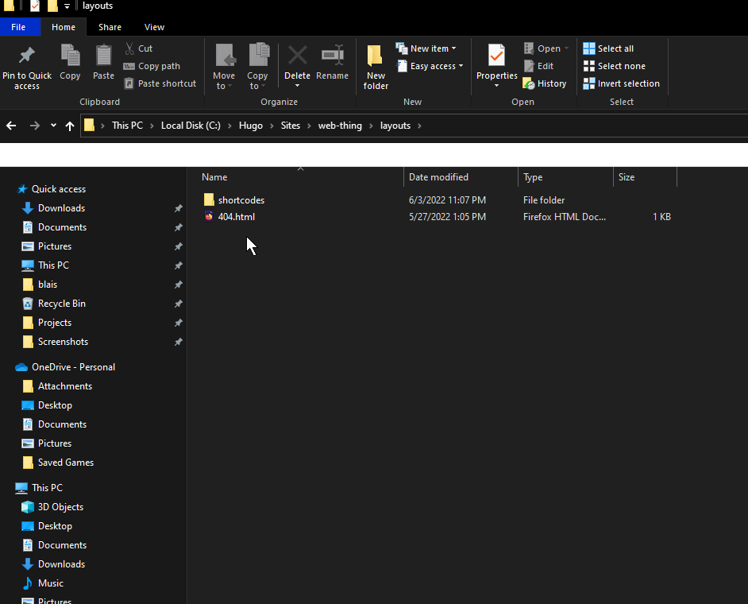
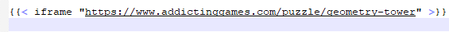
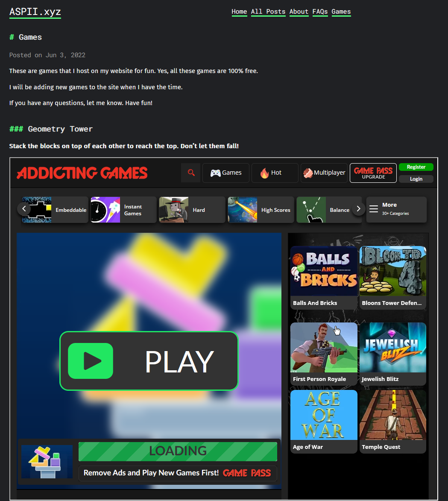

Adding games to your website is one of several ways to make your website more fun.

It encourages users to engage with your site, and it really helps to expand audience interaction.

It's rather easy to add games to an HTML site, simply copying and pasting the embed code.

But what about Hugo? How can we add games to our Hugo site?

This tutorial will show you how to do this.

You can see the games on my site by clicking "Games" at the top.




## Step 1: Creating an iframe shortcode.

We'll start by creating a custom shortcode for inline frames (or iframes)

Shortcodes are simply snippets that are inside content files that allow users to, say, add a youtube video to their website, without adding raw HTML to Markdown content.

For more information on shortcodes in Hugo, go [here](https://gohugo.io/content-management/shortcodes/).

In the **layouts** folder of your root directory (mine is named "web-thing", yours will have a different name), add a new folder titled: **Shortcodes.**


In the **shortcodes** folder, add a new file titled "iframe.html".

Open this file in a text editor of your choice. (I use Notepad++)

Copy and paste this code into that file: `iframe src="{{ .Get 0 }}" width ="1000" height ="800" scrolling ="no"></iframe>`

> Note: the width and height can be set to your choice. One of the games on my site didn't work with 600 as the height, so I made it 800.

There, our shortcode is done! Save the file.

## Step 2A: Understanding embedding

When we add games to our site, we are embedding them.

When we embed games, they look like they're part of your site, but are still hosted by the original site.

If the games is removed from the original site, it's removed from yours, too. (Cowabummer!)

Embedding is usually safe, but you should only embed from trusted websites only.

## Step 2B: Finding games to add

There are plently of sites that host (and sometimes publish) games made in HTML5. (remember, Flash is dead, RIP)

Some of these games will display an embed link, allowing users to embed the game to their own site.

Some websites include:
* https://playpager.com/embed-games/
* https://www.addictinggames.com/embeddable-games/index.jsp
* https://play.idevgames.co.uk/games

When you find a game you want to add, instead of copying the embed link, copy the URL. (for example, the game Narrow Escape's URL is https://play.idevgames.co.uk/game/narrow-escape)

## Step 3: Adding the game to our site.

Create a new `.md` file in the **content** folder of your root directory. Open this file in your text editor.

Add some basic front matter. For example:

```
+++
title = "Games"
date = 2022-06-05
+++
```
> Note: This front matter is formatted in TOML instead of YAML. You can tell because of the +++ at the top and bottom. Hugo supports both YAML and TOML.

In your `.md` file, add this line of code to embed the game to your site. We'll use the URL of Geometry Tower, hosted by AddictingGames.com.



As you can see, we used the shortcode we made earlier.

If needed, configure your **config.toml** file to make a new page for the games. You can view [my file](https://github.com/autonot/aspii.xyz/blob/main/config.toml) for reference.

Save the file, and run your site locally. (For more information on how to do this, go [here](https://aspii.xyz/posts/hugo_tutorial/), and go to Step 6.

When you go to your site, you should see the game.


## Conclusion

That's all there is to it!

It's as simple as making a custom shortcode for iframes, and copying and pasting the URL of the game you want to add to your site.

I hope this tutorial helped you.

If you have any questions, let me know :)


