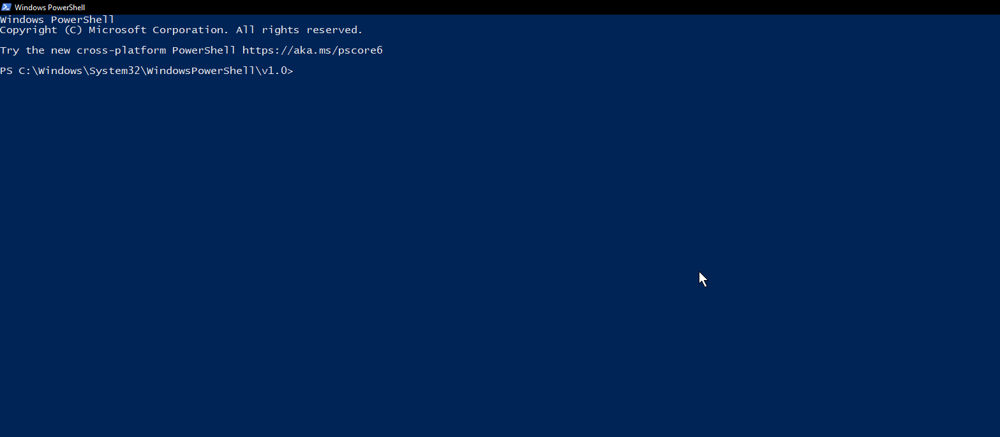
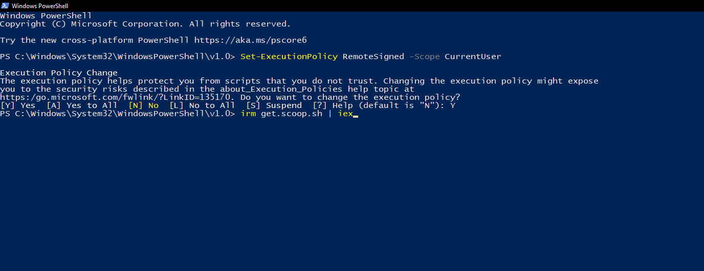
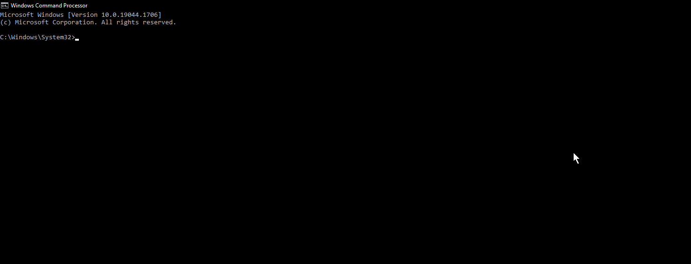
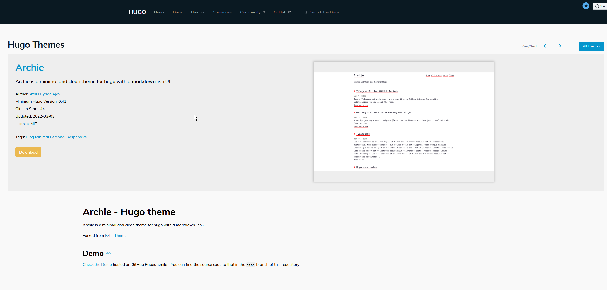
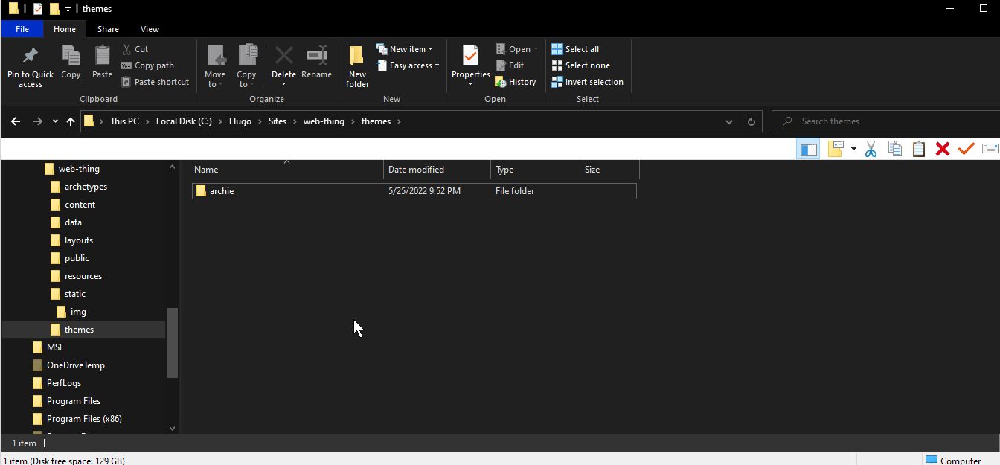
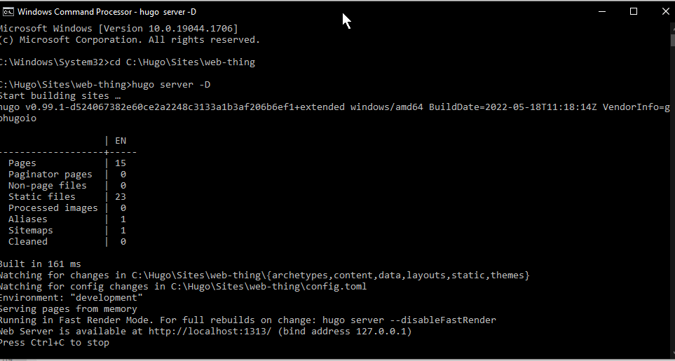
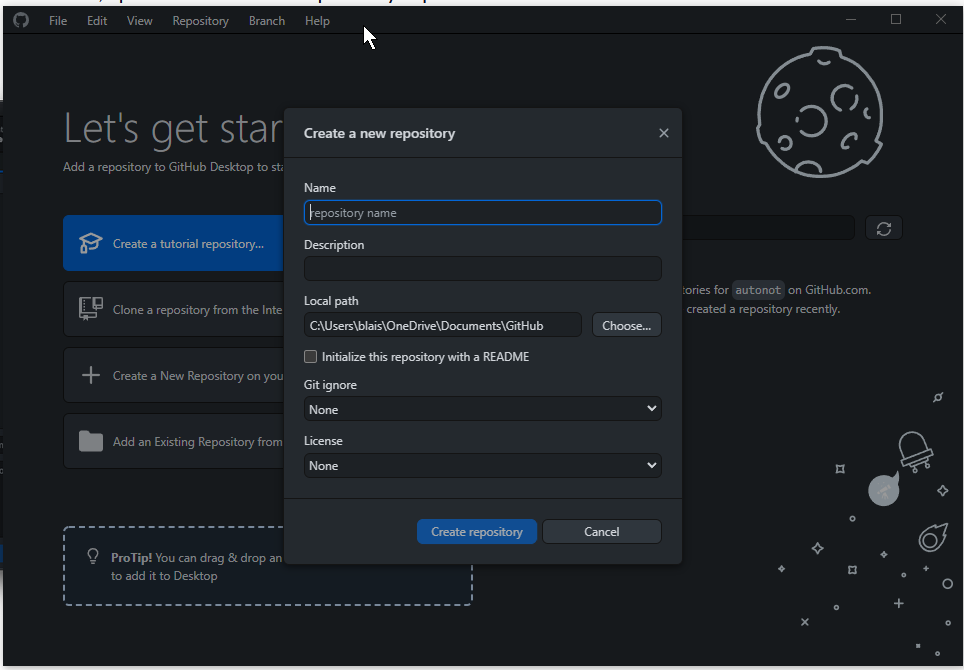
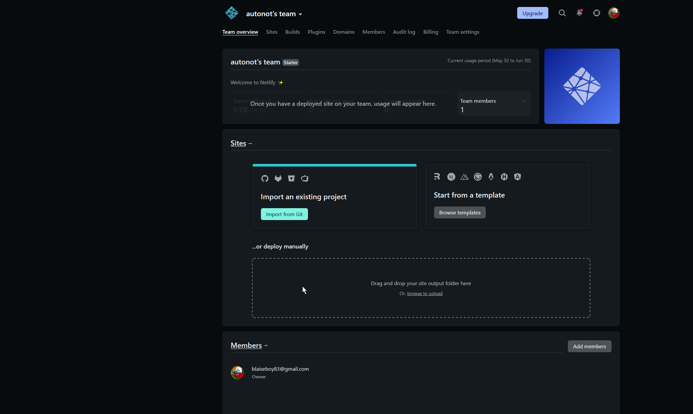

**NOTE: I apologize for how long this post is and the quality of the pictures!! Future posts will be better !!**

In this tutorial, I will show you how to make a website with the Hugo static site generator.

ASPII.xyz (the website you are currently on) is made with Hugo.

It mostly comes down to *Hugo*, which is a static website generator that I used.
It also comes down to *Markdown*, a way to format text with websites like this one.

I'll try to keep this as short as possible, but I have a bad habit of writing more than I need to :confounded:

So, let's get started! :grinning:

**NOTE: I use Windows, so these instructions will be catered to Windows users, go [here](https://gohugo.io/getting-started/installing/) if you use MacOS or Linux.**



## Step 1: Install a package manager

Unfortunately, doing stuff like this on Windows requires some extra steps compared to other operating systems.
You'll have to install a package manager, such as [Chocolatey](https://chocolatey.org/install) or [Scoop](https://scoop.sh/).
This post will focus on Scoop, as that is what I used.

First, open PowerShell by typing powershell.exe into your Start menu. You'll then be greeted by a screen that looks like this:




Next, copy and paste this :arrow_right:
`Set-ExecutionPolicy RemoteSigned -Scope CurrentUser`

When prompted, press "Y" to change the execution policy.

Next, copy and paste this as well :arrow_down:

`irm get.scoop.sh | iex`

Press Enter, and Scoop will install.


Now you have Scoop! but there is still more to be done!

## Step 2: Installing Git

If you don't have Git installed, you should go ahead and install it (you'll need it!)
Simply go [here](https://git-scm.com/downloads) and select your OS, then download the appropriate version of Git.

## Step 2A: Installing a text editor

Installing a nice text editor can make the process of writing posts and configuration easier.

I use [Notepad++](https://notepad-plus-plus.org/downloads/), but you can use something else.


## Step 3: Installing Hugo

Now, we'll go to our Windows Command Processor (better known as cmd.exe)
Type "cmd.exe" into the start menu.

You'll be shown with this:


Simply type `scoop install hugo-extended` and wait...

> Note: You do not need to install the extended version of Hugo, but I do recommend it.
> All the cool themes require the extended version (to my knowledge, at least...)

To verify that Hugo installed correctly, type `hugo version`.

We've finally installed Hugo!! Now comes the fun stuff.

## Step 4: Creating the site

Did you exit the command line? Hopefully not, because we need to stay there for a little longer.
Let's create a new Hugo website.

To do this, use the command: `hugo new site mysite`

> Another note: You can change **mysite** to something else (I named mine **web-thing**) but the process remains the same.

This makes a new directory for your site. You can change into that directory with the command `cd mysite`.

Take some time to explore the folders Hugo created for you, such as the **archetypes** folder, the **content** folder (your blog posts go in here),
the **static** folder (for images and fonts, among other things), and the **config.toml** file (hey, that's not a folder!) It isn't! This is where you can change the configuration of your site.

Now, let's make the site cool looking by adding a theme!

## Step 5: Adding a theme

There are *many, many* themes available in [Hugo's theme directory](https://themes.gohugo.io/). 

I used the Archie theme!


When you find a theme you like, click the download button, to be taken to that theme's GitHub page.

[Here is Archie's GitHub Page.](https://github.com/athul/archie)

To download a theme, go to your Windows Command Line (cmd.exe, remember?) and go to your **themes** directory.
`cd mysite/themes/` and use Git to add it: `git clone https://github.com/athul/archie.git`

> These instructions work for any theme, just replace the Archie link with the link for the theme you want.
>For example, if you'd rather have the PaperMod theme, simply use the command `git clone https://github.com/adityatelange/hugo-PaperMod.git`

After the theme is finished downloading, it will appear in the **themes** folder of your site.



Go to your **config.toml** file and add a line that will activate whichever theme you chose.

Being that I use the Archie theme, I added `theme = 'archie'` to my **config.toml** file.

Simply replace "archie" with the theme you downloaded.

## Step 5A: More configuration

When you go to your **themes** folder, and open the folder with your theme, you'll likely see an **exampleSite** folder in there.
You can look through all the different subfolders in here, such as the **archetypes** folder, the **content** folder, and the **config.toml** file.
If you want, you can copy the theme's **config.toml** file and put it's contents into the **config.toml** file for your site.
However, you do not have to do this.

## Step 6: Previewing the site.

We're almost done. Now, we have to test if everything worked!

In your Windows Command Line, run the command `hugo server -D` in the root directory of your site



When you visit http://localhost:1313/ in your web browser, you should see your site with the theme you chose.

Something cool about Hugo? It's local development server watches for changes you make to your site, and automatically rebuilds it.

Hugo's build speed is *very* fast, and you can see updates in almost real-time. Yep, that's how fast it is.

Now, let's create a blog post!

## Step 7: Adding a post

Of course, you can't have a website without some content, such as blog posts. Or maybe you can, I'm not sure.

But regardless, let's add a new blog post our new site.

Go to your **content** folder, and add a new folder titled: **posts**

> You can add another folder to this one, such as organizing all posts by year. So in your **posts** folder, you can add a folder title **2022** and add all posts you made in 2022 to this folder.

In your **posts** folder, add a new file that ends in `.md`, which is the file extension for Markdown. You can name the file what you want, 
but it's recommended to use **YYYY-MM-DD-just-a-post.md** syntax.

We'll add some front matter to this file. For more info on front matter, go [here](https://gohugo.io/content-management/front-matter/).

```
---

title: "This is a sample post."

date: 2022-05-30

draft: true

---
```

This is front matter, formatted in YAML. This front matter is where data for a post is stored, such as the name, date, tags, etc.

Now, we'll add some text.

When writing a post, make sure the content is under the front matter. For example:

```
---
title: "This is a sample post."

date: 2022-05-30

draft: true
---

This is a sample post that is only made to showcase what Hugo and Markdown can do.
You can do plenty of things with posts, but we're only focusing on the basics
for now.
```

Save the file, and Hugo will rebuild the site. It usually takes mere milliseconds.

Visit the site in your web browser, and you'll see the post.

## Step 8: Deploying the site

Cool, so now we have a working site. 

Now, we need to deploy it, to allow people from all around the world to see it.

There are many ways to deploy static websites like ones made in Hugo, but we'll use Netlify.

Netlify is a popular deployment service for static websites, more info [here](https://www.netlify.com/).

We'll start by creating a new GitHub repository for our new site.

First, open GitHub Desktop. If you don't have it, [You can download it here](https://desktop.github.com/).

At the top, where it says *File*, click **New Repository**



You can name the repo what you want, but I recommend naming it the same name as your site's root directory. (Remember, we named it "mysite")

Another option is to drag the **mysite** folder directly into the app.

Click **Create Repository** and it will push the repo to GitHub.

You can keep the repo private.

Go to Netlify, sign up for an account (you can sign up with your GitHub account), and click **Import from Git** in the dashboard.



Under **Connect to Git Provider**, select **GitHub**.

Authorize Netlify to access private repositories, then pick the repo you just created.

Netlify will automatically identify it as a Hugo repo.

Click "Deploy Site" to...well...*deploy the site!!*

If you edit the site in your local version, you push the changes to GitHub, and Netlify automatically updates the site. Technology rules!

By default, your site will have a .netlify subdomain attached to it. This is fine, but you may want your own custom domain.

Soon, I'll make a post explaining that. :)

## Conclusion

Wow, this post was longer than I wanted to make it, but hopefully this tutorial helped you make your own Hugo website!

Today, we learned to install Hugo, make a new website, add content to it, and deploy it to Netlify. 

I recommend going through Hugo's [documentation](https://gohugo.io/documentation/) to learn more about it. 


